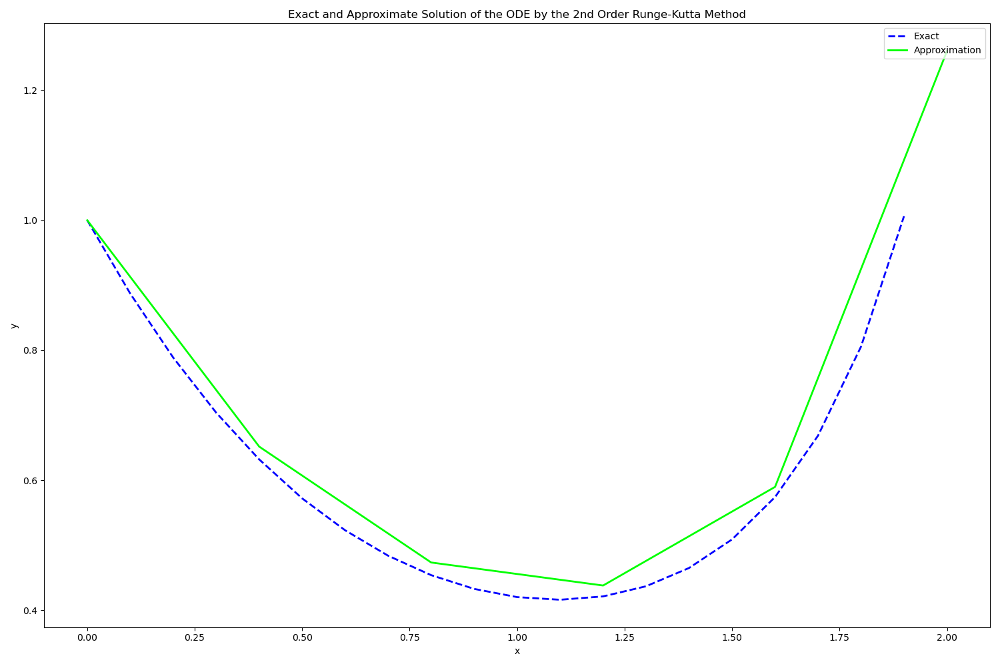
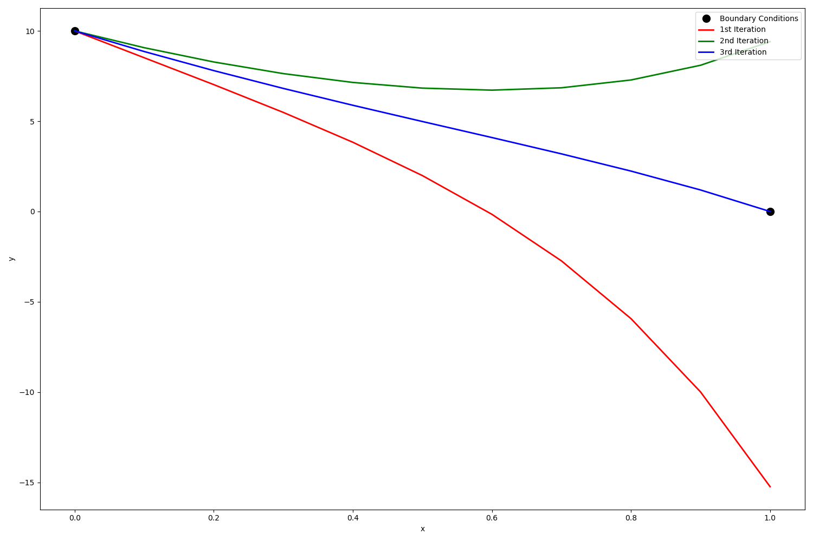

## Numerical Method Illustrations On Python
| Method Name  	|Plot Image   	|
|---	|---	|
|Bisection Method  	|   	|
|Newton Raphson Method  	|   	|
|Naive Gaussian Elimination Method  	| `x[i]=(C[i]-(sum{A[i,j]*X[j]}))/(A[i,i]` `X= [	-15.41	 	-19.48	 	 73.93	 	 71.74	 	-38.86	 	-41.85	]`  	|
|LU Decomposition Method  	| `xi = (zi-(Sum(U[i, j]*X[j], j = i+1 .. n))[i = n-1 .. 1])/U[i, i]` `-26.118749412971287` `X= [	-4.26	 	-0.00	 	-0.83	 	 22.19	 	 16.75	 	-26.12	] `	|
|Lagrangian Interpolation Method   	|   	|
|Trapezoidal Method   	|   	|
|Simpsons 1/3 Rule Method   	|   	|
|Euler's  Method   	|   	|
|Runge Kutta's  Method   	|   	|
|Runge Kutta's  Shooting Method   	|   	|
|   	|   	|

